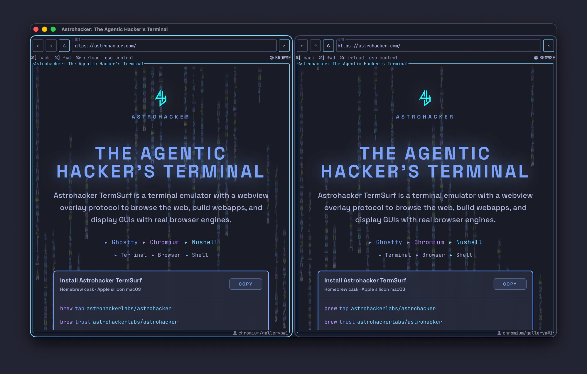
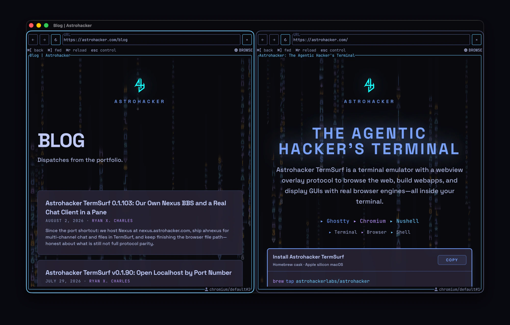
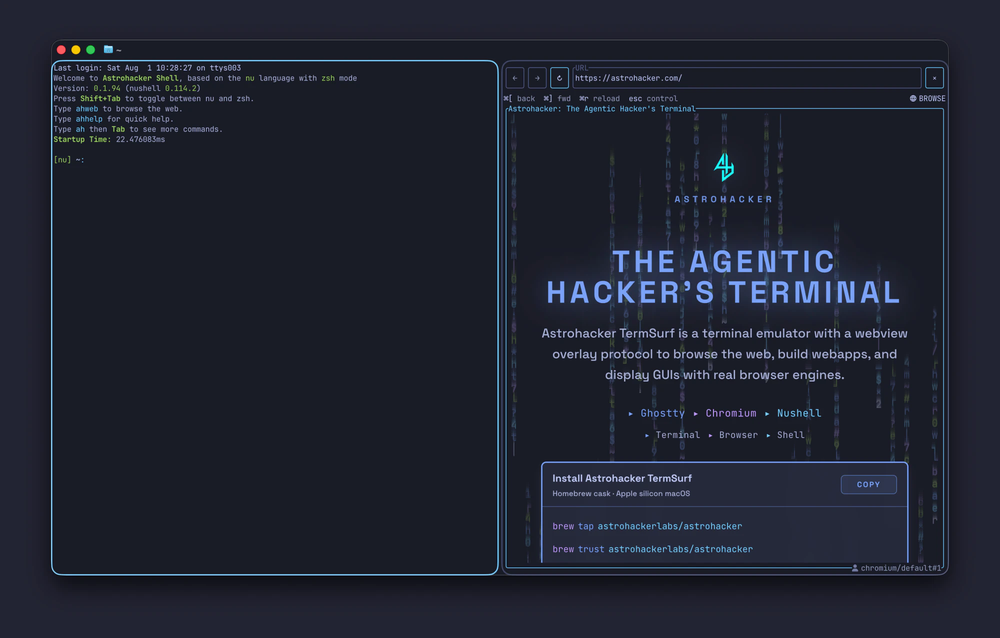
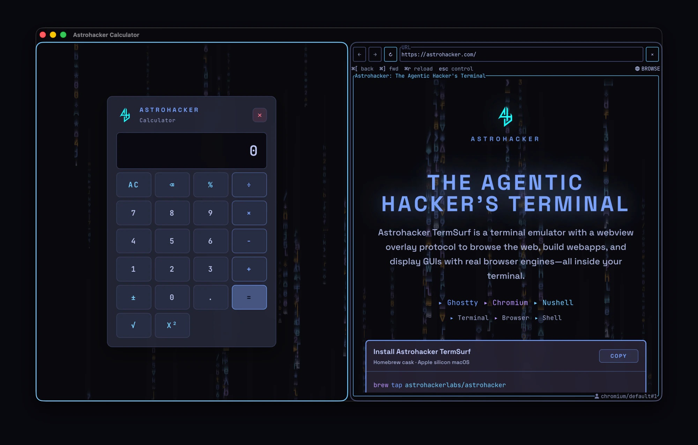
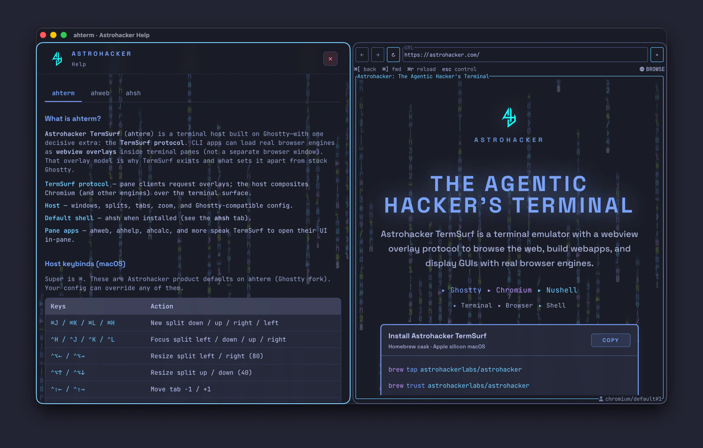
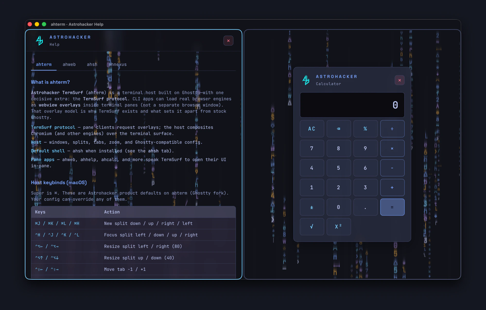
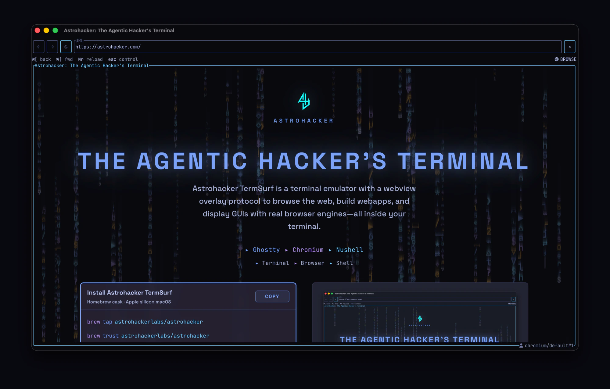
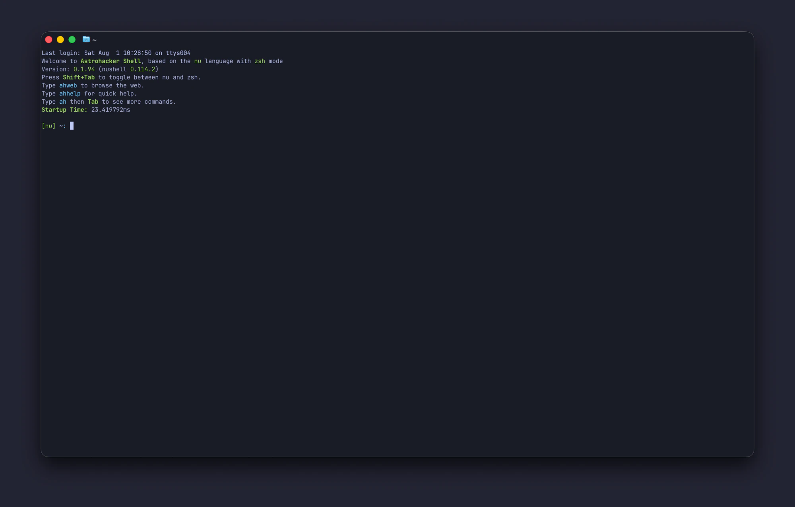

# Astrohacker TermSurf

**Astrohacker TermSurf** is a desktop host with a real browser in the pane. Run
`ahweb`, open a URL, and the page appears alongside shells and other terminal
workflows.

This public repository contains the open source client material synced from the
private Astrohacker monorepo for source releases. It includes:

- `assets/` — TermSurf mark SVG and icon masters (`termsurf-icon.svg`,
  `termsurf-14-*.png`), plus product story screenshots under
  `assets/screenshots/story/`.
- `docs/` — product docs and public legal/records.
- `scripts/` — public build/install helpers and smoke scripts.
  and protocol/native support code.
- `patches/` — fork patch archives and reconstruction notes for Chromium,

Large upstream fork checkouts and build outputs are not committed here. Use the
patch records under `patches/` to reconstruct local engine workspaces when
developing browser integrations.

## Screenshots

Product story shots from a real Astrohacker TermSurf window (multi-profile
first, then composition, then solo surfaces).

### Two different browser profiles in one window



### Two real browser panes at once



### Shell and browser, same window



### Product apps beside the web



### Help open while you browse



### Apps compose with apps



### A real browser engine in the host



### Still a terminal when you want one



## Install

The Astrohacker Homebrew cask targets Apple silicon macOS and installs into
`/Applications` as **Astrohacker TermSurf.app**:

```bash
brew tap astrohackerlabs/astrohacker
brew trust astrohackerlabs/astrohacker
brew install --cask astrohacker
```

To upgrade:

```bash
brew update
brew upgrade --cask astrohacker
```

## Build

Development builds require Xcode, Zig, Rust, Bun, Chromium's `depot_tools`, and

```bash
brew install zig
curl --proto '=https' --tlsv1.2 -sSf https://sh.rustup.rs | sh
curl -fsSL https://bun.sh/install | bash
```

Prepare local engine workspaces from the recorded patch archives, then build the
client components:

```bash
./scripts/build.sh chromium
./scripts/build.sh ahweb
./scripts/build.sh ahterm
```

For a release-style local build:

```bash
./scripts/build.sh all --release
```

The app bundle is written to:

```text
forks/ghostty/macos/build/Release/Astrohacker TermSurf.app
```

## Run

During development, launch the Ghostty-based frontend from the reconstructed
Ghostty workspace:

```bash
cd forks/ghostty
zig build -Demit-macos-app=false
cd macos
./build.nu --configuration Debug --action build
```

Inside Astrohacker TermSurf, run the debug `ahweb` binary and point it at a
local engine build:

```bash
./rust/target/debug/ahweb \
  --browser ./forks/chromium/src/out/Default/ah-chromiumd \
  https://example.com
```

## License

See `LICENSE`, `NOTICE`, and `TRADEMARKS.md`.
